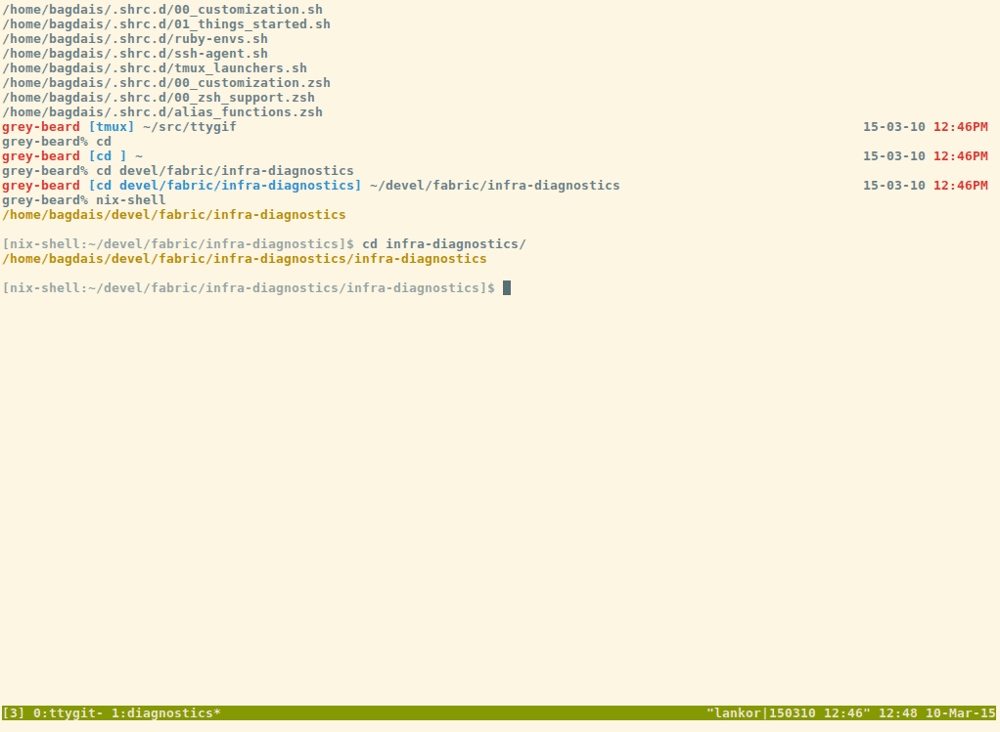

Install & run
-------------

    deploy/bootstrap.py
    .ve/bin/mamba

Test organization
-----------------

Spec files under 'specs/' using the default mamba convention on
*_spec.py file ending.

Example
-------

Running the initial prototype to check if the correct language settings are defined.

